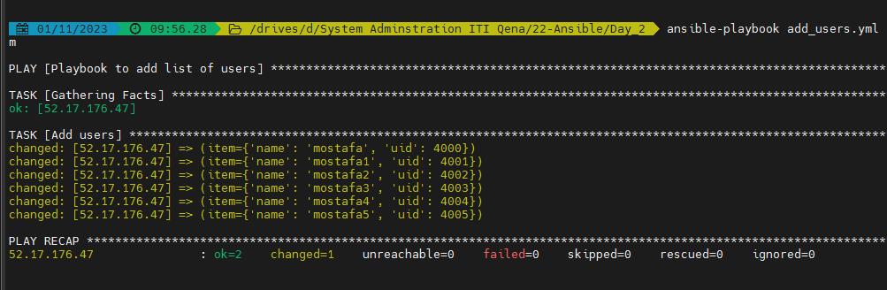
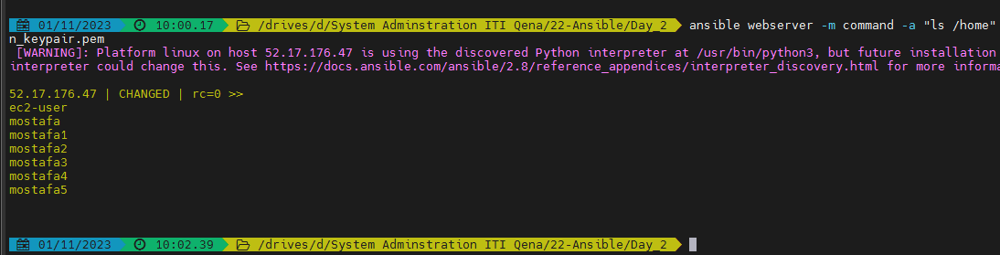
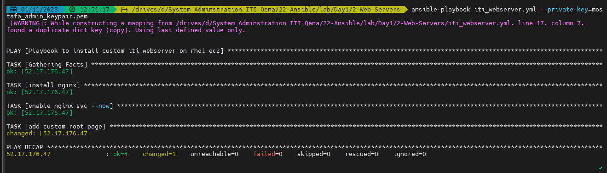
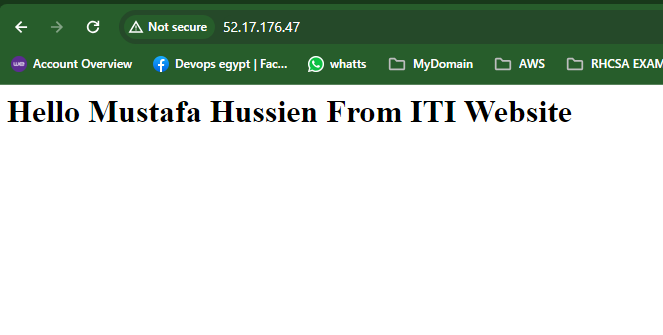

# Ansible Day1

-   You have to create AWS EC2s and use your key file,
 Replace ansible_host variable in inventory files with your EC2s public IPs

- check connectivy
    -   cd day1 folder
    -   Run Command
    
        ```bash
        ansible webserver -m ping
        ```
- OR Can user private key if not use in .ssh
        ```bash
        ansible webserver -m ping  --private-key=mostafa_admin_keypair.pem
        ```
- Check Syntax of playbook
        ```bash
        ansible-playbook add_users.yml --syntax-check
        ```
- ADD Users
        ```bash
        ansible-playbook add_users.yml --private-key=mostafa_admin_keypair.pem
        ```
     -   

    - Check  Users ADDED Or Not by Add hock command
        ```bash
        ansible webserver -m command -a "ls /home" --private-key=mostafa_admin_keypair.pem
        
        ```
     -   

-   Install nginx,  and Creaete custom index page

    -   run command
        ```bash
        ansible-playbook iti_webserver.yml --private-key=mostafa_admin_keypair.pem
        ```
    -   

-   iti website

    
    -   